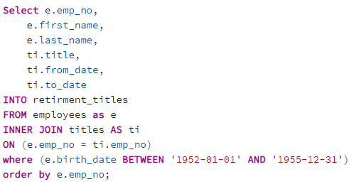
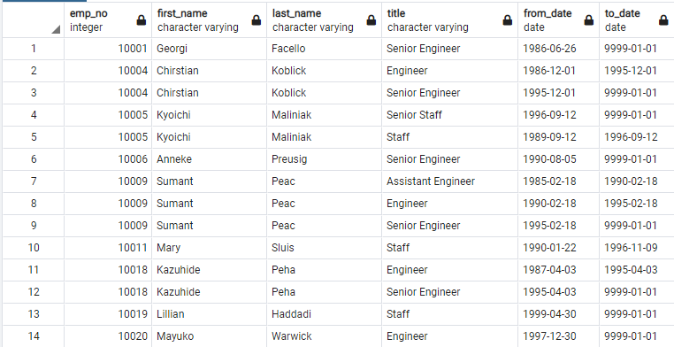
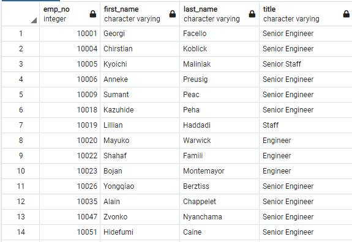
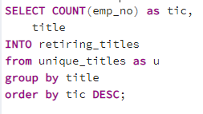

# Operation “Silver Tsunami” - Pewlett-Hackard-Analysis

## Overview of analysis: 
The purpose of this project is to identify the amount of employees that will be retiring soon, as well as determine the amount of employees that are eligible to participate in a mentorship program to help the company fill these positions. We are able to gather this data by utilizing SQL. 

## Employee Database Results:
- Identify the employees that will be retiring  
Using the block of SQL we are able to pull from the data and apply a filter of employees born between 1/1/1952 and 12/31/1995. 

The following table was created. This table has duplicated entries for some employees due to internal promotions. 

- Identify the amount of retire eligible and their most recent job title 
Next a query was created to create a table containing the employee number, full name and most recent table. To do this we removed the duplicate entries and filtered to include only employees that are currently employed. 

![This is an image] (Data/Table-Code images/B.1 Code.PNG)

This resulted in the below table. 

- Identify the amount of employees of each title that will be retiring 
Creating a high level overview of the amount of employees per title we used the below code to help quickly determine the amount of employees leaving grouped by titles they hold. 

- Provided a list of the possible employees that are eligible for a mentorship program. 
To better prepare the amount of employees that are leaving we queried and executed code using SQL to pull the amount of employees that are currently employed and born between January 1, 1965 and December 31, 1965. 
)

## Summary:
- How many roles will need to be filled as the "silver tsunami" begins to make an impact?
over all we can see 72,458 postion will need to be filled. Taking a look at the table we created “Retiring Title” we can easily see which positions will be most impacted, senior engineer, senior staff and engineer being in the top three. These positions will have to prioritize the mentorship programs as more employees leave.
)
- Are there enough qualified, retirement-ready employees in the departments to mentor the next generation of Pewlett Hackard employees?
In order to answer these questions an additional query is needed, similar to the retirement title tabel we created. We can see that there is a far lower amount of mentorship eligible current employees per role. So the company should have no shortage of mentors for their mentees. 
### Additional queries to run:
- queries I would suggest to the one above. a below of a table that shows the amount of employees eligible for the mentor program broken up by title.  
![This is an image]Data/Table-Code images/EX1.PNG
